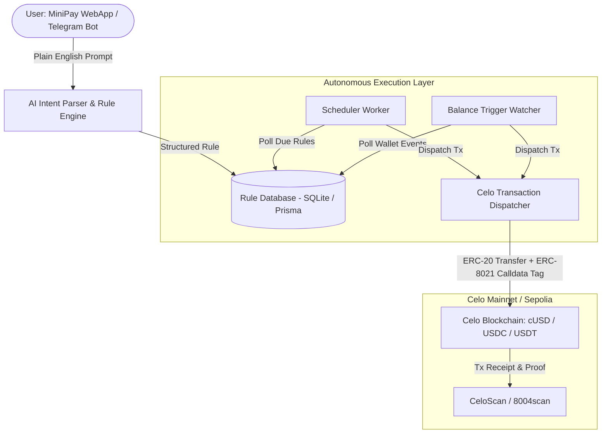

# 🤖 MiniRemit — Always-On Stablecoin Remittance & Payment Agent for MiniPay Users

[](https://celo.org)
[](https://dune.com/celo/agents-at-work-hackathon)
[](https://minipay.opera.com)

**MiniRemit** is an autonomous AI agent that enables real people (especially MiniPay users in emerging markets) to set simple, natural-language payment automation rules once, then the agent runs forever and moves real stablecoins (`cUSD`, `USDC`, `USDT`) on Celo without requiring repeated wallet signatures.

Built for the **[Celo Agents at Work Hackathon](https://celoplatform.notion.site/Agents-at-Work-Hackathon-3c1d5cb803de81139de7f4f3d09e55dc)**.

---

## 🎯 The Problem

In emerging markets across Africa, Latin America, and Southeast Asia, millions of users rely on mobile wallets like **MiniPay** to send remittances to family, pay recurring bills (rent, electricity, data), and save money.

However, traditional blockchain transactions require manual signing for every single action. If a user wants to send $20 to their mother every Friday or split 20% of incoming income into savings, they have to remember, open the app, and manually initiate the transaction every time.

## 💡 The Solution: MiniRemit

**MiniRemit** gives users an autonomous on-chain financial agent. Users express their intent in plain English:
* *"Send $20 cUSD to my mother's wallet every Friday at 10 AM"*
* *"Whenever I receive funds, automatically split 25% to my savings wallet"*
* *"Pay my $15 electricity bill on the 1st of every month"*

The agent parses the intention into a verifiable rule, monitors the schedule and balance triggers, and executes attributed, low-cost stablecoin transfers autonomously on Celo.

---

## 🏗️ Architecture



---

## 🚀 Key Features

* **🗣️ Natural Language Intent Engine:** Understands conversational prompts and converts them into precise schedules (cron expressions) and token amounts.
* **🏷️ Native ERC-8021 Attribution Tagging:** Appends `toDataSuffix(attributionTag)` (`celo_97f21f965c25`) to every transaction calldata so all volume is automatically credited on the Dune Analytics hackathon leaderboard.
* **⚡ Ultra Low-Cost & Fast on Celo:** Transfers settle in seconds with sub-cent gas fees in native stablecoins.
* **📱 Mobile-First & MiniPay Ready:** Responsive interface designed to run seamlessly inside Opera MiniPay webviews.
* **🛡️ Non-Custodial & Verifiable:** Transparent execution history with direct block explorer links to CeloScan.

---

## 🛠️ Tech Stack

* **Frontend:** Next.js 14 (App Router), React, Tailwind CSS, Lucide Icons
* **Blockchain Client:** Viem, Celo Viem Chains (Mainnet & Sepolia)
* **Smart Contracts & Standards:** ERC-20 (`cUSD`, `USDC`, `USDT`), ERC-8021 (Calldata Attribution Tags), ERC-8004 (Agent Identity #9812)
* **Database & ORM:** SQLite with Prisma ORM
* **Scheduler Worker:** Autonomous Node.js daemon using `croner`
* **Agent Engine:** Gemini / OpenAI structured tool calling

---

## 📦 Getting Started

### 1. Clone the repository
```bash
git clone https://github.com/ChuksTech007/MiniRemit.git
cd MiniRemit
```

### 2. Install dependencies
```bash
npm install
```

### 3. Setup environment variables
Copy the template `.env.example` to `.env`:
```bash
cp .env.example .env
```

### 4. Push Database Schema
```bash
npx prisma db push
```

### 5. Run Development Server
```bash
npm run dev
```
Open [http://localhost:3000](http://localhost:3000) in your browser.

### 6. Run Autonomous Execution Worker
In a separate terminal:
```bash
npm run worker
```

---

## 🏆 Hackathon Tracks Targeted

1. **Track 1: Value Moved ($2,000)** — Generates continuous, measurable stablecoin transfer volume between independent parties with ERC-8021 tags.
2. **Track 2: Real World Adoption ($1,750)** — Purpose-built for everyday MiniPay remittance and bill-payment use cases in emerging markets.

---

## 📜 License

MIT License © 2026 CNex Team (Charles-Chukwudi Chukwudi)
