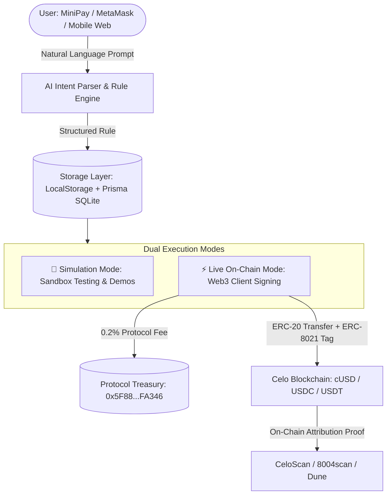

# 🤖 MiniRemit - Always-On Stablecoin Remittance & Payment Agent for MiniPay Users

[](https://celo.org)
[](https://8004scan.io/agents/celo/9812)
[](https://dune.com/celo/agents-at-work-hackathon)
[](https://minipay.opera.com)

**MiniRemit** is an autonomous financial AI agent that empowers mobile wallet users (such as MiniPay, MetaMask, and Valora users on Celo) to establish recurring payment, remittance, and fund-splitting rules in plain English. Once set, the agent executes attributed, non-custodial stablecoin (`cUSD`, `USDC`, `USDT`) transfers seamlessly on Celo.

Built for the **[Celo Agents at Work Hackathon](https://celoplatform.notion.site/Agents-at-Work-Hackathon-3c1d5cb803de81139de7f4f3d09e55dc)**.
* **ERC-8004 Registry:** [8004scan.io/agents/celo/9812](https://8004scan.io/agents/celo/9812)
* **Attribution Tag:** `celo_97f21f965c25`
* **Live App:** [https://mini-remit.vercel.app](https://mini-remit.vercel.app)

---

## 🎯 The Problem

In emerging economies across Africa, Latin America, and Southeast Asia, millions of users rely on mobile wallets like **MiniPay** to send remittances to families, pay recurring utilities (electricity, internet, rent), and save money.

However, traditional Web3 workflows require manual intervention and signing for every single action. If a user wants to send $20 to their mother every Friday or split 20% of incoming income into a savings wallet, they must remember, open the app, and manually initiate the transaction every time.

## 💡 The Solution: MiniRemit

**MiniRemit** introduces an autonomous on-chain financial agent. Users simply type their intent in natural language:
* *"Send $20 cUSD to 0x742... every Friday at 10 AM"*
* *"Whenever I receive funds, automatically split 25% to my savings wallet"*
* *"Pay my $15 electricity bill on the 1st of every month"*

The agent parses the intent into a verifiable rule, monitors schedules and balance triggers, and executes non-custodial, attributed stablecoin transfers directly on Celo.

---

## 🏗️ Architecture



---

## 🚀 Key Features

* **🗣️ Natural Language Intent Engine:** Converts plain English into precise schedules (cron expressions) and token amounts.
* **🎛️ Dual-Mode Execution Switcher:**
  * **🧪 Simulation Mode:** Instant, risk-free sandbox environment where anyone can test rules, watch simulated transactions, and inspect agent behavior without spending gas or tokens.
  * **⚡ Live On-Chain Mode:** Connect any Web3 wallet (MetaMask, MiniPay, Brave, Rainbow) to dispatch actual Celo mainnet transactions with live balance tracking.
* **🏷️ Native ERC-8021 Attribution Tagging:** Appends `toDataSuffix(attributionTag)` (`celo_97f21f965c25`) to every transaction calldata, ensuring all volume is verifiable on Dune Analytics.
* **💎 Sustainable Business Model:** 0.2% micro-fee automatically routed to the protocol treasury (`0x5F88E4aEfD97c5bE5Fb88e56F07ca4105c3FA346`), monetizing volume while remaining 10x cheaper than traditional remittance services (which charge 5–8%).
* **📱 Mobile-First & MiniPay Ready:** Optimized for fast loading in low-bandwidth environments and inside MiniPay webviews.
* **🛡️ Non-Custodial Security:** Users keep full custody of their keys; transactions are signed directly through client Web3 providers.

---

## 🗄️ Data Storage & Privacy Architecture

MiniRemit adopts a **privacy-preserving, client-first storage strategy**:
1. **Client Persistence (Current V1):** Rules and execution history are stored locally in the user's browser (`localStorage`) with Prisma SQLite fallback for local development. This ensures zero data leaks, zero server maintenance overhead, and total user privacy.
2. **On-Chain Ledger:** Live transfers and receipts are permanently verifiable on the Celo blockchain.
3. **Roadmap (V2):** Optional MongoDB Atlas / decentralized IPFS sync for multi-device synchronization and decentralized background keeper networks.

---

## 🛠️ Tech Stack

* **Frontend:** Next.js 14 (App Router), React, TypeScript, Tailwind CSS, Lucide Icons
* **Blockchain Client:** Viem, Celo Viem Chains (Mainnet & Sepolia)
* **Smart Contracts & Standards:** ERC-20 (`cUSD`, `USDC`, `USDT`), ERC-8021 (Calldata Attribution Tags), ERC-8004 (Agent Registry #9812)
* **Storage:** Hybrid LocalStorage & Prisma SQLite
* **Agent Engine:** Structured Natural Language AI Parser

---

## 📦 Getting Started

### 1. Clone the repository
```bash
git clone https://github.com/ChuksTech007/MiniRemit.git
cd MiniRemit
```

### 2. Install dependencies
```bash
npm install
```

### 3. Setup environment variables
Copy the template `.env.example` to `.env`:
```bash
cp .env.example .env
```

### 4. Run Development Server
```bash
npm run dev
```
Open [http://localhost:3000](http://localhost:3000) in your browser.

---

## 🏆 Hackathon Tracks Targeted

1. **Track 1: Value Moved ($2,000)** - Generates continuous, measurable stablecoin transfer volume between independent parties with ERC-8021 tags.
2. **Track 2: Real World Adoption ($1,750)** - Purpose-built for everyday MiniPay remittance and bill-payment use cases in emerging markets.

---

## 📜 License

MIT License © 2026 CNex Team (Charles-Chukwudi Chukwudi)
